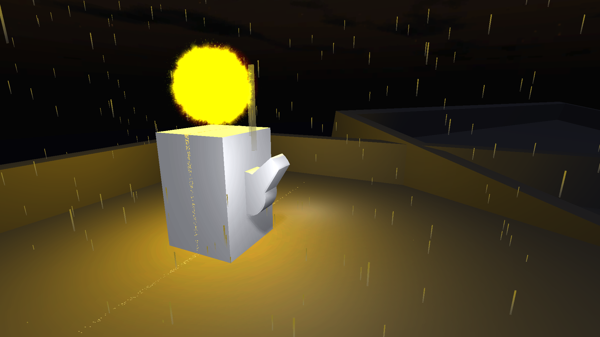

[Demo video](https://vimeo.com/76393579)

This project requires three pieces of software to run: Arduino, openFrameworks and Unity.

Arduino controls the LEDs and detects whether or not an LED is connected.
Unity contains the virtual world with virtual LEDs which can be switched on and off.
openFrameworks stitches the two together by communicating over serial with arduino and via OSC with Unity.

The Unity scene that needs to be run is called Flood.  Ignore the others.

References for the sounds used are in `Unity/Flood/Assets/Sounds/References.txt`.